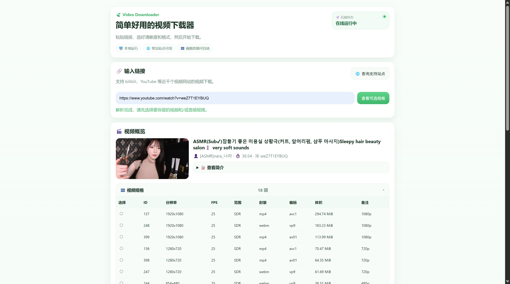
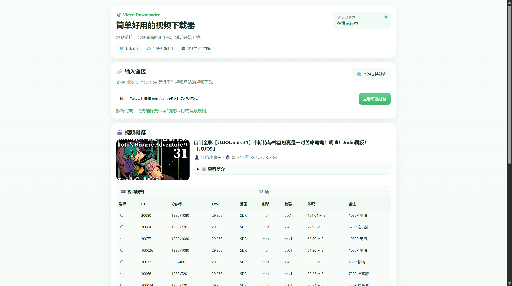

# Video Downloader

## 界面预览

### YouTube



### Bilibili



一个面向日常使用的本地视频下载工具。

它以极其成熟的 **yt-dlp** 作为下载与解析核心，以 **ffmpeg** 作为音视频处理核心，并提供一个更直观的网页界面，用来辅助完成链接解析、规格选择、格式转换和下载管理。

## 特性

- 基于 `yt-dlp` 的本地前端封装，结合 `ffmpeg` 可以选择视频规格、音频规格与输出格式
- 支持 `cookies.txt` 导入，适配部分需要登录信息的网站

## 支持站点查询

站点支持范围以 `yt-dlp` 为准，有近千个网页，常见包括：Bilibili、网易云音乐、YouTube、TikTok/抖音、X/Twitter、Instagram、Niconico等。

可在应用内查询是否支持：


## 安装

在该项目文件夹下运行：

```powershell
conda env create -f .\environment.yml
```

## 启动

在该项目文件夹下运行：

```powershell
conda activate video-downloader
python main.py
```

启动后终端会输出本地地址，在浏览器中打开即可。例如：

```text
http://127.0.0.1:8765
```

## 关于 cookies.txt

部分网站或视频会要求登录、年龄验证、会员权限或额外校验。  
这种情况下，可以在界面中导入 `cookies.txt`。工具也提供了如何获取cookies的教程。
